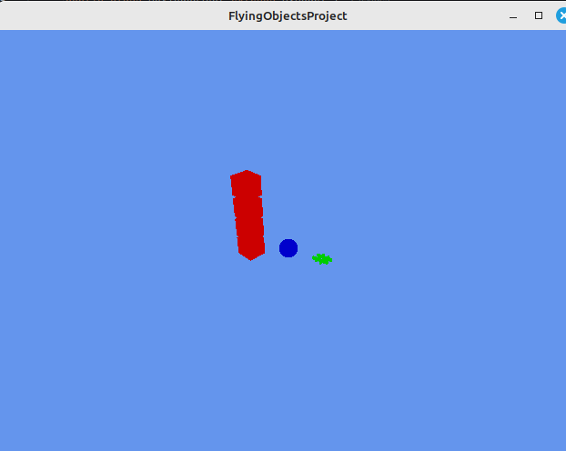

Java-C-Assignments / libGDX Flying Objects Project

This project is a libGDX project generated using gdx-liftoff. The template includes simple application launchers and an ApplicationAdapter extension that draws the libGDX logo, along with basic 3D object rendering. The project has been customized with additional code that loads custom models (for example, a sphere, cube, and hash object) and implements simple orbiting animations, camera zoom controls, and rotation. It also demonstrates basic texture application and custom model movement.

Platforms:
- core: Contains application logic that is shared by all platforms.
- lwjgl3: The primary desktop platform using LWJGL3 (formerly known as 'desktop' in older documentation).

Gradle:
The project uses Gradle for dependency management and building. The Gradle wrapper is included, so you can run tasks using commands such as:
• ./gradlew build         – Builds sources and archives.
• ./gradlew clean         – Removes build folders.
• ./gradlew lwjgl3:jar    – Builds a runnable jar (located in lwjgl3/build/libs).
• ./gradlew lwjgl3:run    – Starts the application.
• ./gradlew test          – Runs unit tests (if any).

Useful Gradle flags include:
• --continue             – Continue tasks despite errors.
• --daemon               – Use the Gradle daemon.
• --offline              – Use cached dependency archives.
• --refresh-dependencies – Force validation of all dependencies.

Custom Modifications and Assets:
- Custom Code:
  • The main application (extending ApplicationAdapter) sets up a 3D scene with a perspective camera, ambient lighting, and three model objects: a stationary object (blue sphere), a moving object (red cube), and another moving object (green hash) with orbiting behavior.
  • Subclasses of a common model class (MyModel) handle model loading, transformation (scaling, translation, rotation), texture application, and drawing.
  • The moving objects include logic to update their positions over time (using orbit parameters and a timer) and rotate continuously.
- Custom Image:
  • A file named "flyingobjects.png" is placed at the root of the project directory. This image can be used as a texture on one or more objects by loading it using the libGDX file handling system (e.g., via Gdx.files.internal("flyingobjects.png")). This ensures that your custom image is bundled with the project and available at runtime.

Build and Run Instructions:
- Using Gradle:
  • Open a terminal in the project root directory.
  • Run "./gradlew build" to build the project.
  • To run the desktop application, execute "./gradlew lwjgl3:run".
- In IntelliJ IDEA:
  • Open the project by selecting the project directory (e.g., /home/patrick/IntelleJProjects_home/IntelleJProjects_home/TSJAVACardanoStarter).
  • IntelliJ will import the Gradle project automatically.
  • Use the Gradle tool window or a run configuration to execute the lwjgl3:run task.

Summary:
This project is a libGDX application generated with gdx-liftoff and customized to include additional code for 3D model rendering, movement, and camera control. It uses Gradle for building and supports both core shared logic and an LWJGL3-based desktop implementation. The inclusion of "flyingobjects.png" at the project root allows you to use your custom image as a texture or for other purposes within the application. This document covers the project structure, custom modifications, asset handling, and instructions for building and running the application.
